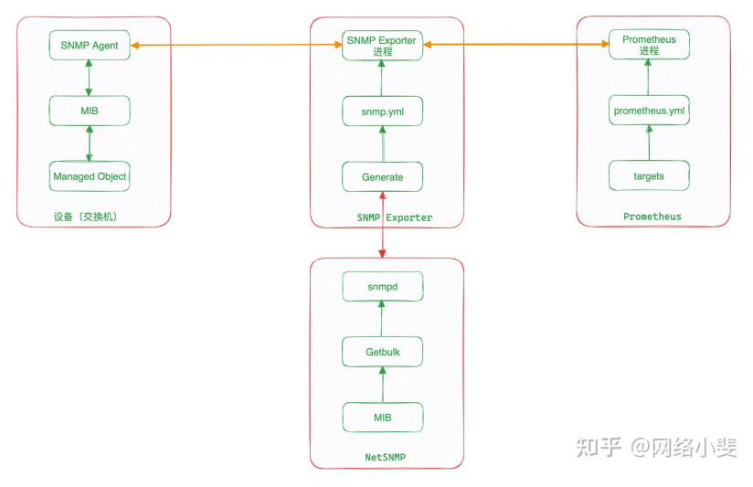

  <h1 align="center">SNMP Exporter Prometheus Network device monitoring</h1>
  

    <a href="README.md"><strong>English</strong></a> | <strong>简体中文</strong>
  

## Table of Contents

- [Repository Introduction](#repository-introduction)
- [Prerequisites](#prerequisites)
- [Image Specifications](#image-specifications)
- [Getting Help](#getting-help)
- [How to Contribute](#how-to-contribute)

## Repository Introduction
‌[SNMP Exporter‌](https://github.com/prometheus/snmp_exporter) The SNMP Exporter is an official component of the Prometheus ecosystem, designed to collect monitoring metrics from network devices (such as switches, routers, firewalls, etc.) via the SNMP (Simple Network Management Protocol) and convert them into Prometheus-compatible time-series data formats.

**Core Features:**
1. Protocol Conversion Bridging: The core function is to convert the OID data queried by SNMP (Simple Network Management Protocol) devices into a metrics format (HTTP/HTTPS) that Prometheus can scrape and recognize. It serves as a crucial bridge between traditional network device monitoring and modern cloud-native monitoring systems.
2. Flexible Generator Architecture: Utilizes a generator model based on the generator.yml configuration file and MIB (Management Information Base) files. Users do not need to write code; they only need to define the required OIDs and their mappings in YAML to automatically compile and generate the final snmp.yml configuration file, greatly simplifying the monitoring configuration of complex devices.
3. Powerful Metric Mapping: Supports intelligent mapping of SNMP query results (scalar values, table data) into Prometheus metric formats (Gauge, Counter, Histogram, etc.). For example, it can automatically convert ifInOctets and ifDescr from the interface table (IF-MIB) into vector metrics snmp_if_in_octets with ifIndex and ifDescr labels.
4. Automatic Discovery and Metric Generation: Automatically discovers OIDs supported by devices through walk operations and supports generating the initial skeleton of the generator configuration file via walk, significantly reducing the manual effort of finding and configuring OIDs and lowering the configuration threshold.
5. Highly Configurable Filtering and Renaming: Supports filtering OIDs in the generator and collector configurations to only collect the necessary metrics. Additionally, it supports renaming metric names (metric name) and label keys (label key) to better conform to Prometheus naming conventions and improve readability.
6. Modular Configuration for Multiple Devices: Supports predefining and reusing different configuration modules (modules) for devices of different brands and models (such as Cisco, Juniper, F5, etc.). By specifying the module used by the target device in the main configuration, a single Exporter can monitor multiple heterogeneous network devices.
7. Efficient Bulk Data Collection: Supports bulk retrieval of SNMP table data through GETBULK operations, significantly reducing the number of queries and network round-trip overhead compared to traditional GETNEXT queries, thereby greatly improving collection efficiency, especially for tables with a large number of entries (such as routing tables, ARP tables).
8. Security and Multi-Version Support: Supports multiple protocol versions of SNMP v1, v2c, v3. Provides full support for SNMP v3, including authentication (MD5, SHA) and encryption (DES, AES) functions, meeting the security requirements of different network environments.

This project offers pre-configured [**`SNMP Exporter-Prometheus Network device monitoring`**]()，images with SNMP Exporter and its runtime environment pre-installed, along with deployment templates. Follow the guide to enjoy an "out-of-the-box" experience.

**Architecture Design:**

> **System Requirements:**
> - CPU: 4vCPUs or higher
> - RAM: 16GB or more
> - Disk: At least 50GB

## Prerequisites
[Register a Huawei account and activate Huawei Cloud](https://support.huaweicloud.com/usermanual-account/account_id_001.html)

## Image Specifications

| Image Version          | Description | Notes |
|------------------------| --- | --- |
| [SNMPExporter0.28.0-kunpeng-v1.0](https://github.com/HuaweiCloudDeveloper/prometheus-snmp-exporter-image/tree/SNMPExporter0.28.0-kunpeng-v1.0?tab=readme-ov-file) | Deployed on Kunpeng servers with Huawei Cloud EulerOS 2.0 64bit |  |

## Getting Help
- Submit an [issue](https://github.com/HuaweiCloudDeveloper/prometheus-snmp-exporter-image/issues)
- Contact Huawei Cloud Marketplace product support

## How to Contribute
- Fork this repository and submit a merge request.
- Update README.md synchronously based on your open-source mirror information.