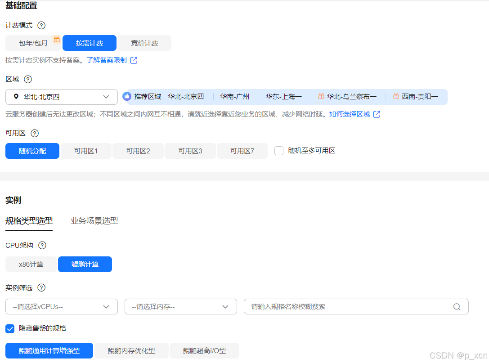

# SNMP Exporter 使用指南

# 商品链接

[SNMP Exporter-Prometheus网络设备监控]()

# 商品说明

‌SNMP Exporter 是 Prometheus 生态的官方组件，用于通过 ‌SNMP 协议‌（Simple Network Management Protocol）采集网络设备（如交换机、路由器、防火墙等）的监控指标，并将其转换为 Prometheus 兼容的时序数据格式‌。

# 商品购买

您可以在云商店搜索 **SNMP Exporter**。

其中，地域、规格、推荐配置使用默认，购买方式根据您的需求选择按需/按月/按年，短期使用推荐按需，长期使用推荐按月/按年，确认配置后点击“立即购买”。

# 商品资源配置

商品支持 **ECS 控制台配置**，下面对资源配置的方式进行介绍。

## ECS 控制台配置

### 准备工作

在使用ECS控制台配置前，需要您提前配置好 **安全组规则**。

> **安全组规则的配置如下：**
> - 入方向规则放通端口 `9116`，**源地址内必须包含您的客户端 ip**，否则无法访问
> - 入方向规则放通 CloudShell 连接实例使用的端口 `22`，以便在控制台登录调试
> - 出方向规则一键放通

### 创建ECS

前提工作准备好后，选择 ECS 控制台配置跳转到购买 ECS 页面，ECS 资源的配置如下图所示：

> **值得注意的是：**
> - VPC 您可以自行创建
> - 安全组选择 [**准备工作**](#准备工作) 中配置的安全组；
> - 弹性公网IP选择现在购买，推荐选择“按流量计费”，带宽大小可设置为5Mbit/s；
> - 高级配置需要在高级选项支持注入自定义数据，所以登录凭证不能选择“密码”，选择创建后设置；
> - 其余默认或按规则填写即可。

# 商品使用

## SNMP Exporter 使用

### 查看SNMP Exporter服务端状态

systemctl status snmp-exporter

### 查看当前指标

http://ip:9116

### 参考文档

[SNMP Exporter官网](https://github.com/prometheus/snmp_exporter)